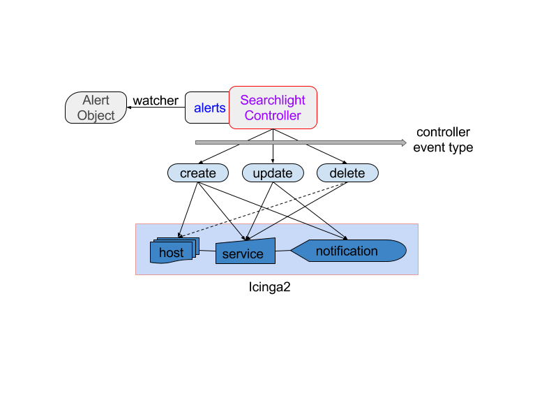
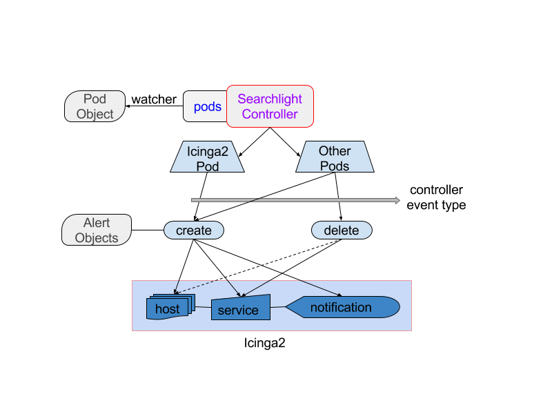
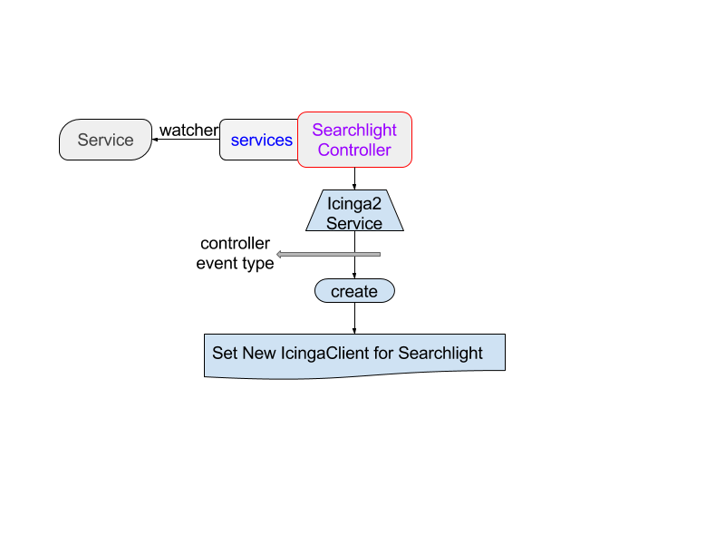

# Architecture

This guide will walk you through the architectural design of Searchlight Controller.

## Searchlight Controller

Searchlight Controller collects all information from a watcher.
This Watcher watches all Kubernetes objects.

See details [here](watcher.md).

Controller detects following ResourceEventType:

* ADDED
* UPDATETD
* DELETED

## Workflow

### Resource `Alert`

* #### EventType `ADDED`
    1. When an Alert object is created, Searchlight Controller detects it.
    2. Controller determines for which Kubernetes object this alert will be set.
    3. Controller will then create following Icinga2 objects:
        1. Host - Create Icinga2 host for each Kubernetes object.
        2. Service - 
            * Create Icinga2 service in each host.
            * Alert name will be used as Icinga2 service name.
        3. Notification -
            * Create Icinga2 notification in each service.
            * Alert name will be used as Icinga2 notification name.

    Three types of Icinga2 host:

    1. ###### localhost
     
        | Kubernetes Object                                                                                         | CheckCommand               | Icinga2 Host                            |
        | :---                                                                                                      | :---                       | :---                                    |
        | cluster                                                                                                   | `<supported any>`          | `<check_command>@<namespace>`           |
        | deployments    daemonsets   replicasets   statefulsets   replicationcontrollers   services | pod_exists   pod_status | `<objectType>|<objectName>@<namespace>` |
        Assigned Host IP: `127.0.0.1`

    2. ###### node
     
        | Kubernetes Object  | CheckCommand      | Icinga2 Host               |
        | :---               | :---              | :---                       |
        | cluster   nodes | `<supported any>` | `<node_name>@<namespace>`  |
        Assigned Host IP: `<node_ip>`
        > Note: If Alert is set on cluster, Icinga2 host will be created for each node in that cluster.

    3. ###### pod
    
        | Kubernetes Object                 | CheckCommand      | Icinga2 Host              |
        | :---                              | :---              | :---                      |
        | `< any except [cluster, nodes] >` | `<supported any>` | `<pod_name>@<namespace>`  |
        Assigned Host IP: `<pod_ip>`
        > Note: If Alert is set on kubernetes object, Icinga2 host will be created for each pod under that object.

    Important:

    1. Every checkCommand can be set on selected Kubernetes objects.
    2. Controller will automatically create multiple Icinga2 host if necessary.
    3. All informations are provided in [icinga.json](../../data/files/icinga.json).
    4. For any invalid information provided in Alert object, controller will skip to create Icinga2 objects

* #### EventType `UPDATETD`
    1. When an Alert object is updated, Searchlight Controller detects it.
    2. Controller determines where this update will be applied.
    3. Controller will then update following Icinga2 objects:
        1. Service - followings can be updated
            * check_interval
            * Custom variables  
        2. Notification - followings can be updated
            * interval

    Important:
    
    1. For any invalid information provided in Alert object, controller will skip to update Icinga2 objects.
    

* #### EventType `DELETED`
    1. When an Alert object is deleted, Searchlight Controller detects it.
    2. Controller determines which Icinga2 objects should be deleted.
    3. Controller will then delete following Icinga2 objects:
        1. Service - those are created for this alert.
        2. Host - those are created for this alert if there is no service left in it.
    
    Important:

    1. Controller will automatically delete multiple Icinga2 host if necessary.
    2. If there is only one service ‘ping4’ is available in host, host will be deleted while deleting Alert.

### Resource `Pod`

* #### EventType `ADDED`
    ###### Icinga2 Pod
    1. When Icinga2 pod is created, Searchlight Controller detects it.
    2. Controller gets all Alert objects and create Icinga2 objects for all of them in new Icinga2 pod.

        > Note: Fake create event for each Alert object is invoked.

    ###### Other Pod
    1. When pod is created, Searchlight Controller detects it.
    2. Controller finds out its ancestors such as services, replicasets, daemonsets, etc.
    3. Controller then determines all Alert objects applied to its ancestors.
    4. Controller determines which Icinga2 objects should be created for each Alert.
    5. Controller will then create related Icinga2 objects for this pod.

        > Note: Pod itself is considered as its ancestor. It allows applying alerts while recreating pod with same name.

* #### EventType `DELETED`
    1. When pod is deleted, Searchlight Controller detects it.
    2. Controller finds out its ancestors such as services, replicasets, daemonsets, etc.
    3. Controller then determines all Alert objects applied to its ancestors and itself.
    4. Controller determines which Icinga2 objects should be deleted for each Alert.
    5. Controller will then delete related Icinga2 objects for this pod.

        > Note: Any alert directly applied to a pod is left intact, when the pod is deleted. If a new pod is created with same name, alert will be reapplied.

### Resource `Node`

* #### EventType `ADDED`
    1. When node is created, Searchlight Controller detects it.
    2. Controller then determines all Alert objects applied to this node.
    3. Controller determines which Icinga2 objects should be created for each Alert.
    4. Controller will then create related Icinga2 objects for this node.

* #### EventType `DELETED`
    1. When node is deleted, Searchlight Controller detects it.
    2. Controller then determines all Alert objects applied to this node.
    3. Controller determines which Icinga2 objects should be deleted for each Alert.
    4. Controller will then delete related Icinga2 objects for this node.

### Resource `Service`
 
* #### EventType `ADDED`

    ###### Icinga2 Service
    1. When Icinga2 service is created, Searchlight Controller detects it.
    2. Searchlight creates new IcingaClient with new service endpoint.
